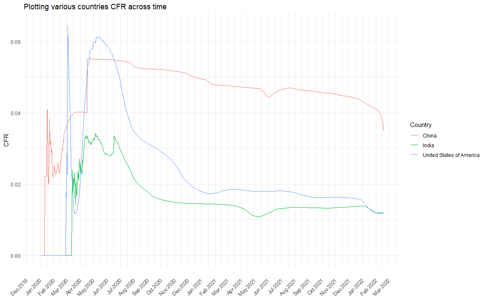

```{r setup, include=FALSE}
knitr::opts_chunk$set(echo = TRUE)
```

## Introduction
The main objective of this report is to summarise all the discussions and suggestions provided by all the members of team 5 and few members from various other teams. The discussion is arranged in a question-answer format where in I try and answer all the questions raised and try to incorporate the suggestions into the final report.

## Suggestions and Findings

1. *What is CIDRAP? What do they do? The acronym is introduced but never written out completely.*

The Center for Infectious Disease Research and Policy (CIDRAP) is a center within the University of Minnesota that focuses on addressing public health preparedness and emerging infectious disease. Their main principles are summarised below:

* Consensus building: Convening experts to assess problems, analyze available information, and develop effective public policy recommendations and guidance. Consulting with and catalyzing policy makers, business leaders, and the medical and public health communities to act.

* Research: Conducting and facilitating targeted research on the detection, epidemiology, ecology, and transmission of infectious diseases, as well as on policies and practices that advance effective public health responses.

* Information synthesis: Conducting critical review and analysis of available scientific and public policy information on selected topics and generating authoritative, accurate, and current Web-based content.

* Communication: Making current information widely available to educate and inform healthcare providers, public health professionals, business leaders, students, opinion leaders, policymakers, the media, and others across the nation and around the world.

* Interdisciplinary partnerships: Working collaboratively with a wide range of public health, environmental, veterinary, and medical researchers and experts, as well as philanthropic groups and foundations, throughout the world to develop and support new initiatives.

* Education and training: Providing education and training opportunities (such as classroom teaching, mentorship, workshops, online training, and exercises) targeted to a wide range of audiences, including CIDRAP staff, university students at all levels, and professionals in public or private sectors domestically and internationally.

In context with the progress report, Stephanie Soucheray from CIDRAP suggests that there has been a 40\% decline ([CIDRAP](https://www.cidrap.umn.edu/news-perspective/2022/02/covid-19-cases-drop-40-us)) in the covid-19 cases in the past month from the 1st week to 2nd week. 

2. *Why does India have a lower case fatality rate (CFR) than the countries being compared at the begining of the pandemic*

To put the question in context, it arises from the plot shown below.



There are multiple reasons why specifically India has had overall lower CFR as opposed to other countries like US and China:

* The first asymptomatic Covid-19 case India has was on 30th January, 2020 , 3 students from Wuhan who had returned back to India. However the first fatality India saw because of covid-19 was on 12th March, 2020. The number of deaths has been 0 till 12th March, 2020 indicative of the low CFR in the initial phases. By definition of CFR: 

$$
Y_{CFR} = \frac{\text{Total Deaths}}{\text{Total Cases}}
$$

* Number of active cases have been always higher than the deaths due to the large population size. 

* India has lower CFR due to cross - immunity from other viruses as well as the majority of India's population is young. India has more than 50\% of its population below the age of 25 and more than 65\% of its population below the age of 35. The covid-19 virus was known to be more dominant in people older than 65 and people with respiratory conditions.[[Nature Article](https://www.science.org/content/article/indias-covid-19-cases-have-declined-rapidly-herd-immunity-still-far-away-scientists-say#:~:text=India's%20fatality%20rate%20has%20decreased,cross%2Dimmunity%20from%20other%20viruses)]

3. *Be careful of deriving causal inference from boxplot comparing time periods before and after time bans. What are some potential confounding factors that also be causing a decline in CFR ?*

Here are few madates that could be confounding factors in the decline of the CFR:

* Introduction of the mask mandate
* Introduction of travel ban mandate
* Introduction of vaccination requirements and other mandates
* Reduction in the potency of the covid-19 virus ie. lesser deaths but more active cases which we observed in the latest variant to date, the Omicron virus.

4. *Panel data isnt longitudnal or cross-sectional data, it is a combination of both*

Panel data, sometimes referred to as longitudinal data, is data that contains observations about different cross sections across time. Examples of groups that may make up panel data series include countries, firms, individuals, or demographic groups. In this scenario, we tend to divide the data based on various covid waves as opposed to different years. It would also depend on the aggregation techniques used for the data. Whether we realistcally need only weekly data or daily data. I would also need to select a few countries rather than including all countries since there is a high possiblity of unreported data from such countries before setting up the data for panel regression.


5. *Roadmap is clear and concise. If followed properly you should be good*  

The roadmap helps in setting up a realistic timeline for completion of the project in context. It is a balance of the time and the effort required to achieve it , given the other responsiblities on top of this.

## Acknowledgement
The discussion was carried out between all members of team 5 and few members of other teams.

## Session Info
```{r}
sessionInfo()
```