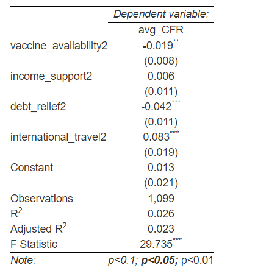

```{r setup, include=FALSE}
knitr::opts_chunk$set(echo = TRUE)
```

## Introduction 
The main objective of this report is to summarise all the discussions and suggestions provided by all the members of team 5 and few members from various other teams. The discussion is arranged in a question-answer format where in I try and answer all the questions raised and try to incorporate the suggestions into the final report. These changes are fundamental in accepting all changes suggested by the peers, adding onto a layer of verification on top of the proof reading done by me. 

## Suggestions and Findings 

1. *Perhaps mention why you fit the model with the predictors not set as factors*

All the predictors being studied in the report aka. International Travel, Debt Relief, Income Support and Vaccine Availability are converted from numerical values to factors and fit into the model as factors. This can be seen from the summary of the model being displayed. The summary is attached for context: 

<p align = "center">  </p>

The number next to all the variables is indicative of the level of the variable being used. The level of a factor variable is indicative of all possible values the variable can take. In this study all the factor variables take the levels of '1' and '2'. 

2. *Might want to discuss any preprocessing you did (like how you changed the levels of the predictors to 0 and 1)*

From the oxford dataset consisting of data regarding policies ([Link Here](https://github.com/OxCGRT/covid-policy-tracker)), we can see that all the variables mentioned above have 2 or 3 levels. For this study we just want to look at pre and post implication of the mandate and study the effective ness of the mandates. In order to do so, we relevel using the following function: 

```{r echo = TRUE, eval=FALSE, message=FALSE, warning=FALSE, include=TRUE, paged.print=TRUE}
relevel_vals <- function(x){
	if(x > 0){
		return(2)
	}
	else{
		return(1)
	}
}

final_df_summ[cols] <- lapply(final_df_summ[cols], function(col) sapply(col , relevel_vals))
```

The variables are being leveled from anything ranging  [0,4] -> [1,2]. It basically implies the pre and post implication period of the mandate.
 
3. *Why you are using a fixed effects model and not a random effects model* 

A fixed-effects model supports prediction about only the levels/categories of features used for training. A random-effects model, by contrast, allows predicting something about the population from which the sample is drawn. There can be categories/levels of the features/factors which may not have been present in the sample. If the effect size related to the variance between the samples drawn is large enough, it can be fairly concluded that the population will exhibit that effect.

Fixed effects models are recommended when the fixed effect is of primary interest. Mixed-effects models are recommended when there is a fixed difference between groups but within-group homogeneity, or if the outcome variable follows a normal distribution and has constant variance across units. Finally, the random-effects models are appropriate for studies where it is not possible to identify which individuals belong to which subgroups (i.e., nesting is not possible).

If the fixed effect model is used on a random sample, one can’t use that model to make a prediction/inference on the data outside the sample data set. The fixed-effects model assumes that the individual-specific effect is correlated to the independent variable. The random-effects model allows making inferences on the population data based on the assumption of normal distribution. The random-effects model assumes that the individual-specific effects are uncorrelated with the independent variables. Since we know that the sample being studied is based on the population given in the dataset, it makes more sense to use a fixed effect model as opposed to a random effect model. 

4. *Why causal inference can or cannot be used for this analysis?*

Causal inference is the process of determining the independent, actual effect of a particular phenomenon that is a component of a larger system. The main difference between causal inference and inference of association is that causal inference analyzes the response of an effect variable when a cause of the effect variable is changed. The science of why things occur is called etiology. Causal inference is said to provide the evidence of causality theorized by causal reasoning. Since the data being studied is  because the WHO COVID-19 dataset is a time series, which means it is observational data and not randomly sampled data. Therefore, the results and conclusions will not be as a result of causal inference, but rather general associations.

## Acknowledgement 

The discussion was carried out between all members of team 5 and few members of other teams.

## Session Info
```{r}
sessionInfo()
```

